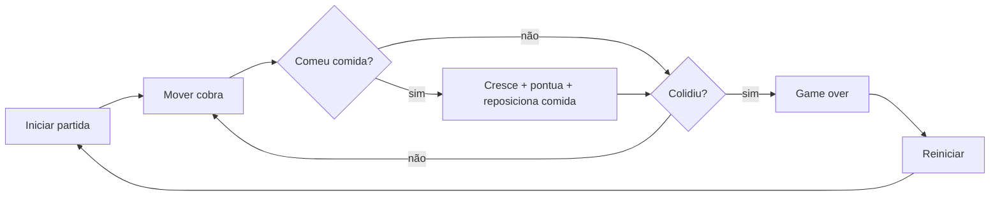

<div align="center">

# Snake Clássico

Um Snake simples, responsivo e testado, feito com HTML, CSS e JavaScript puro.

```
┌──────────────────────────────┐
│  S S S S . . . . . . . . F   │
│  . . . S . . . . . . . . .   │
│  . . . S . . . . . . . . .   │
│  . . . . . . . . . . . . .   │
└──────────────────────────────┘
```

`S` = cobra | `F` = comida | objetivo: crescer sem bater

</div>

## Visão geral

Este branch entrega um jogo de Snake clássico com:

- Tabuleiro 20x20 renderizado no navegador.
- Controles por setas, WASD, botões mobile e gesto de deslizar.
- Pausa por botão ou barra de espaço.
- Reinício rápido pelo botão `Reiniciar`.
- Comida aleatória fora do corpo da cobra.
- Colisão com parede e com o próprio corpo.
- Velocidade progressiva por tempo de partida e tamanho da cobra.
- Som com liga/desliga.
- Tela cheia em dispositivos mobile quando suportado pelo navegador.
- Recordes pessoais salvos localmente no navegador.
- Testes automatizados com `node:test`.

## Fluxo do jogo



## Como iniciar localmente

Requisitos:

- Node.js instalado.
- Python 3 instalado, usado apenas para servir os arquivos estáticos.

Instale dependências, se o projeto passar a ter alguma no futuro:

```bash
npm install
```

Inicie o servidor local:

```bash
npm start
```

O script executa:

```bash
python3 -m http.server 5173
```

## Onde abrir o jogo

Com o servidor rodando, abra:

[http://localhost:5173](http://localhost:5173)

Também funciona acessando o IP local da máquina na mesma porta, caso você queira testar em um celular conectado na mesma rede.

**Você também pode acessar a versão publicada do projeto:**

[https://snake-byte-game.netlify.app/](https://snake-byte-game.netlify.app/)

## Como jogar

| Ação | Desktop | Mobile |
| --- | --- | --- |
| Mover | Setas ou WASD | Deslizar no tabuleiro ou tocar nos botões direcionais |
| Pausar/continuar | Barra de espaço ou botão `Pausar` | Botão `Pausar` |
| Reiniciar | Botão `Reiniciar` | Botão `Reiniciar` |
| Som | Botão `Som ligado/desligado` | Botão `Som ligado/desligado` |
| Tela cheia | Não aparece em mouse/teclado | Botão `Tela cheia`, quando suportado |

## Como rodar os testes

Execute:

```bash
npm test
```

O comando roda a suíte nativa do Node:

```bash
node --test
```

Os testes cobrem a lógica principal da cobra e dos recordes:

- Movimento no sentido atual.
- Crescimento e pontuação ao comer.
- Colisão com parede.
- Bloqueio de reversão imediata quando a cobra tem tamanho maior que 1.
- Posicionamento de comida fora da cobra.
- Aumento de velocidade por tempo e tamanho.
- Ordenação e limite dos recordes pessoais.

## Checklist manual de validação

Use esta lista antes de considerar o jogo pronto para entrega visual e funcional.

### Controles

- [ ] No desktop, as setas movem a cobra para cima, baixo, esquerda e direita.
- [ ] No desktop, WASD replica o comportamento das setas.
- [ ] A barra de espaço alterna entre pausado e jogando.
- [ ] Quando a cobra tem mais de 1 segmento, tentar inverter diretamente a direção não vira a cobra contra o próprio corpo.
- [ ] Os botões direcionais aparecem em dispositivo touch e mudam a direção corretamente.
- [ ] O gesto de deslizar no tabuleiro muda a direção no eixo predominante do movimento.

### Reinício

- [ ] Clicar em `Reiniciar` volta a pontuação para `0`.
- [ ] A cobra volta para o centro do tabuleiro.
- [ ] A partida volta a ficar jogável depois de um game over.
- [ ] O status deixa de mostrar `Game over. Clique em Reiniciar.` após o reinício.

### Colisão

- [ ] Bater na parede encerra a partida e mostra o estado de game over.
- [ ] Bater no próprio corpo encerra a partida.
- [ ] Depois do game over, a cobra não continua andando.
- [ ] A pontuação final positiva entra nos recordes pessoais.

### Comida

- [ ] A comida aparece em uma célula livre do tabuleiro.
- [ ] Ao comer, a pontuação aumenta em 1.
- [ ] Ao comer, a cobra cresce em 1 segmento.
- [ ] Ao comer, uma nova comida aparece fora do corpo da cobra.
- [ ] Em navegador com vibração suportada, o celular vibra brevemente ao comer.

### Mobile

- [ ] O layout cabe na tela sem rolagem lateral.
- [ ] Os botões mobile têm área de toque confortável.
- [ ] O swipe funciona sem mover a página enquanto o gesto acontece sobre o tabuleiro.
- [ ] O botão `Tela cheia` aparece em dispositivo touch.
- [ ] Entrar e sair de tela cheia atualiza o texto do botão.
- [ ] Ao trocar de app, esconder a aba ou perder foco, o jogo pausa automaticamente.

## Estrutura do projeto

```text
.
├── index.html              # Marcação principal do jogo
├── styles.css              # Layout, tabuleiro e responsividade
├── src/
│   ├── main.js             # Integração DOM, controles, loop e renderização
│   ├── snakeLogic.js       # Regras puras do jogo
│   ├── highScores.js       # Recordes pessoais no navegador
│   └── musicPlayer.js      # Controle de som
└── tests/
    ├── snakeLogic.test.js  # Testes da regra do jogo
    └── highScores.test.js  # Testes dos recordes
```

## Dicas de desenvolvimento

- Prefira mudar regras em `src/snakeLogic.js`, porque essa parte é testável sem navegador.
- Mantenha interações de tela em `src/main.js`.
- Sempre rode `npm test` depois de alterar regra de movimento, comida, colisão, velocidade ou recordes.
- Para validar mobile, teste pelo navegador em modo responsivo e também em um aparelho real quando possível.
